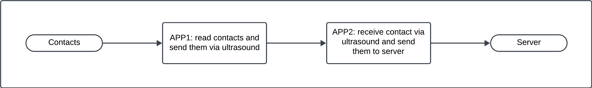
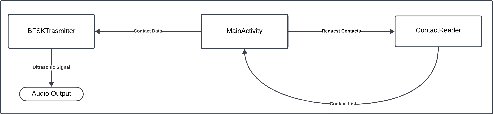
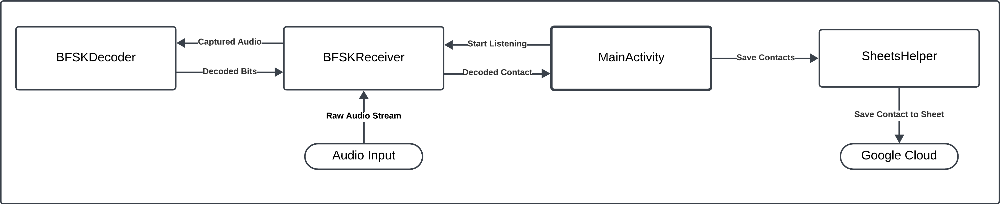

# **Contact Stealer**

## **Main Purpose**

The project consists of developing two distinct applications capable of *exfiltrating* the phone’s contact list. The objective is to demonstrate a “covert” (hidden) communication channel that does not raise suspicion, by distributing sensitive permissions across the two apps:

- **App1 (Transmitter)**: requests permission to read the contact list and sends it via ultrasonic BFSK signals.
- **App2 (Receiver)**: requests microphone usage permission and, once the signals are decoded, sends the extracted contacts to Google Sheets (or another destination).

This ensures no single app has both access to the contact list and the ability to send data over the internet: the exfiltration is achieved through an ultrasonic audio channel, and the second app only requests microphone permissions (thereby appearing less suspicious in terms of contact access).

---

# **Communication Protocols and Precautions**

## **2.1 BFSK Protocol (Binary Frequency-Shift Keying)**

- **BFSK** is a modulation technique that uses two distinct frequencies to represent the binary values `0` and `1`.
- In the implementation, the selected frequencies are `freq0 = 20000 Hz` and `freq1 = 20500 Hz`, both in the ultrasonic range and inaudible to most humans.
- For each bit, the transmitter generates a short sinusoidal tone of a fixed duration (e.g., 100 ms), modulated at the corresponding frequency.

## **2.2 Redundancy and Majority Voting**

- Each bit is repeated 3 times (**repetitions**) to reduce decoding errors caused by environmental noise.
- On the receiver side, a triple buffer with **majority voting** reconstructs the original bit.

## **2.3 Transmission Improvement Precautions**

- **Fade In / Out**: During transmission, each tone includes a *fade-in* and *fade-out* (5 ms) to reduce audio “clicks” and sharp transients.
- **Contact Transmission Pauses**: A delay of 1000 ms is introduced between contact transmissions to avoid overlap and disturbances.
- **BandPass Filters**: On the receiver side, band-pass filters centered around the two frequencies enhance BFSK signal extraction and reduce noise.

---

# **Description of App1 (Transmitter)**

## **3.1 General Structure**

- **Package**: `com.example.contactreader`
- **Permissions**: Requests *READ_CONTACTS* to access the device’s contact list.
- **Primary Functionality**: Reads all the contacts from the phonebook and transmits them one by one using BFSK (ultrasonic) signals.

## **3.2 Main Classes**

1. **MainActivity**
   - Manages the UI using Jetpack Compose:
     - A `Start Transmission` button (`onClickStart`) begins the contact transmission process.
     - A `Stop Transmission` button (`onClickStop`) halts the transmission.
   - Requests the *READ_CONTACTS* permission if it hasn’t been granted yet.
   - Runs a coroutine job (`Dispatchers.Default`) to loop through and transmit contacts one by one.
   - Displays the status (`info`) on the screen.

2. **ContactReader (Singleton object)**
   - Helper class that reads the contact list using Android’s `ContactsContract` API.
   - Returns a list of strings in the format `"Name:Number"`.

3. **BFSKTransmitter (Singleton object)**
   - Contains the logic for BFSK transmission:
     - Frequencies used: 20 kHz (bit `0`), 20.5 kHz (bit `1`).
     - Bit repetition (3 times) and *fade in/out* of 5 ms.
   - **Main Functions**:
     - `transmitSingleContact(contact: String)`: Creates the BFSK frame (preamble + length + payload + suffix), repeats bits, generates tones, and transmits them using an `AudioTrack`.
     - `buildFrame(...)`: Converts a string into bits and adds BFSK preamble and suffix.
     - `playBitString(...)`: Writes data for each bit to an `AudioTrack`.
     - `generateToneWithFade(...)`: Generates a `Short` array for a single tone with *fadeIn/fadeOut* to reduce audio clicks.

---

# **Description of App2 (Receiver)**

## **4.1 General Structure**

- **Package**: `com.example.contactsender`
- **Permissions**: Requests *RECORD_AUDIO* to listen to sounds using the microphone.
- **Primary Functionality**: Receives BFSK signals, decodes the contacts, and sends them to Google Sheets using OAuth credentials (service account).

## **4.2 Main Classes**

1. **MainActivity**
   - UI built with Jetpack Compose:
     - A `Start Listening` button (`onStartListening`) initiates BFSK reception.
     - A `Stop Listening` button (`onStopListening`) stops the recording.
   - Initializes `SheetsHelper` at startup to load credentials and prepare the connection to Google Sheets.
   - Displays decoded contacts and reception status in a text view (`info`).

2. **BFSKReceiver**
   - Manages an `AudioRecord` to listen for BFSK signals via the microphone.
   - Uses a `BFSKDecoder` to decode bits and applies **majority voting** logic (3 bits -> 1 bit).
   - Recognizes the BFSK frame (preamble `10101010`, length, payload, suffix `11110000`) and reconstructs the `Name:Number` string.
   - Calls `onContactReceived(...)` upon successfully decoding a complete contact.

3. **BFSKDecoder**
   - Filters incoming audio with two band-pass filters (`BandPassFilter`) centered on the BFSK frequencies.
   - Calculates energy in each channel to determine if the bit is `0` or `1`.
   - Returns a bit string, which is processed by the receiver to extract contacts.

4. **BandPassFilter**
   - Implements a band-pass filter (simplified biquad) to isolate 20 kHz and 20.5 kHz frequencies, enhancing SNR and decoding quality.

5. **SheetsHelper**
   - Handles authentication and data writing to Google Sheets:
     - Loads service account credentials from `assets/credentials.json`.
     - Initializes the `Sheets` object (Google API) for data writing.
     - With `appendRowToSheet(contact: String)`, appends a row (Name, Number, Timestamp) to the sheet `"Foglio1"` (columns A, B, C).

---

# **Contact**

- **Email**: [angeloantona.contact@gmail.com](mailto:angeloantona.contact@gmail.com)
- **LinkedIn**: [Angelo Antona](https://www.linkedin.com/in/angeloantona/)